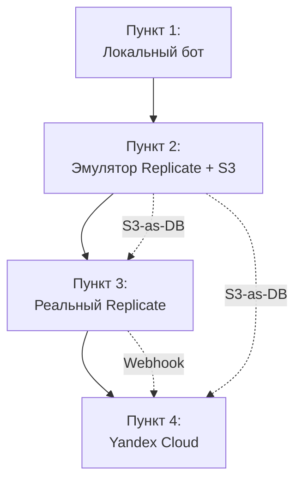

# Развернутый план разработки Telegram-бота (Пункты 1-4)

## Обзор архитектуры

Проект развивается от простого синхронного бота к serverless-архитектуре с использованием S3 как хранилища состояния (вместо БД). План покрывает локальную разработку и последующий переход на Yandex Cloud.

## Пункт 1: Локальный бот с базовыми командами

### Цель

Создать простой Telegram-бот с командами `/start` и обработкой фото, который возвращает то же фото обратно пользователю.

### Задачи

1. **Настройка окружения**

   - Создать `requirements.txt` с зависимостями: `python-telegram-bot`, `requests`, `python-dotenv`
   - Создать `.env` файл для хранения `TG_BOT_TOKEN`
   - Настроить `.gitignore` для исключения `.env` и временных файлов

2. **Реализация базового бота** (файл `bot_local.py` или обновить `main.py`)

   - Команда `/start`: приветственное сообщение с инструкциями
   - Обработчик фото (MessageHandler с filters.PHOTO):
     - Скачивание фото через `get_file()`
     - Немедленная отправка того же фото обратно через `send_photo()`
   - Базовая обработка ошибок и логирование

3. **Тестирование**

   - Запуск бота локально через polling
   - Проверка команды `/start`
   - Проверка отправки фото и получения того же фото обратно

### Файлы

- `bot_local.py` (или обновить `main.py`)
- `requirements.txt`
- `.env` (шаблон `.env.example`)

---

## Пункт 2: Интеграция с локальным эмулятором Replicate

### Цель

Добавить локальный HTTP-сервис, эмулирующий Replicate API (асинхронные вебхуки), и интегрировать его с ботом через архитектуру S3-as-DB.

### Задачи

1. **Настройка локальной инфраструктуры (Docker Compose)**

   - Создать `docker-compose.yml`:
     - Сервис `minio` (порт 9000 - API, 9001 - консоль)
     - Сервис `app` (FastAPI приложение, порт 8000)
   - Настроить переменные окружения для MinIO в `.env`

2. **Настройка MinIO (S3-эмулятор)**

   - Создать скрипт инициализации или инструкцию:
     - Создать бакет `my-bot-bucket`
     - Настроить структуру: `images/input/` и `tasks/`
     - (Опционально) Настроить lifecycle policy для автоочистки `tasks/` старше 1 дня

3. **Создание локального эмулятора Replicate** (файл `mock_replicate.py`)

   - FastAPI приложение с эндпоинтом `POST /v1/predictions`
   - Принимает запрос с `input.image` (URL), `webhook` (URL), `webhook_events_filter`
   - Генерирует `prediction_id` (UUID)
   - Сохраняет задачу в память/файл (для тестов)
   - Асинхронно (через `asyncio.create_task`) эмулирует обработку:
     - Имитация задержки 2-5 секунд
     - Копирование исходного изображения как "результат" (или простая трансформация)
     - Отправка POST-запроса на указанный `webhook` с данными:
       ```json
       {
         "id": "prediction_id",
         "status": "succeeded",
         "output": "https://url-to-result.jpg"
       }
       ```

4. **Обновление бота для работы с S3 и вебхуками**

   - Миграция с `python-telegram-bot` (polling) на FastAPI (webhook-режим)
   - Создать `main.py` (FastAPI) с двумя эндпоинтами:
     - `POST /webhook/telegram`: обработка сообщений от Telegram
     - `POST /webhook/replicate`: обработка колбэков от эмулятора Replicate
   - В `handler.py` (или модуль внутри `main.py`):
     - При получении фото: скачать через Telegram API, загрузить в S3 (`images/input/{uuid}.jpg`)
     - Генерировать presigned URL для S3-файла (срок действия 1 час)
     - Отправить запрос в эмулятор Replicate (`mock_replicate.py`) с `webhook: BASE_URL/webhook/replicate`
     - Сохранить состояние в S3: `tasks/{prediction_id}.json` с `{"chat_id": 123}`
     - Отправить пользователю: "Задачу принял, ожидайте"
   - В `callback.py` (или модуль внутри `main.py`):
     - При получении вебхука от эмулятора: извлечь `prediction_id` и `status`
     - Прочитать `tasks/{prediction_id}.json` из S3, получить `chat_id`
     - Если `status == "succeeded"`: отправить фото через Telegram `sendPhoto` (URL из `output`)
     - Если `status == "failed"`: отправить сообщение об ошибке
     - (Опционально) Удалить `tasks/{prediction_id}.json`

5. **Настройка ngrok для локальной разработки**

   - Инструкция по установке и запуску `ngrok http 8000`
   - Обновление `BASE_URL` в `.env` с URL от ngrok
   - Настройка Telegram webhook: `https://api.telegram.org/bot{TOKEN}/setWebhook?url={BASE_URL}/webhook/telegram`
   
   **Зачем нужен ngrok?**
   
   Telegram Bot API и Replicate API отправляют webhook-и на ваш сервер по HTTPS. Локальный сервер (`localhost:8000`) недоступен из интернета. Ngrok создает публичный HTTPS-туннель к локальному серверу, позволяя принимать webhook-и от внешних сервисов во время локальной разработки.

6. **Работа с S3 (boto3)**

   - Настроить клиент boto3 с `endpoint_url=http://minio:9000` (или `http://localhost:9000` для локальных вызовов)
   - Реализовать функции: `upload_to_s3()`, `download_from_s3()`, `generate_presigned_url()`, `save_task_state()`, `load_task_state()`

### Файлы

- `docker-compose.yml`
- `main.py` (FastAPI приложение)
- `mock_replicate.py` (эмулятор Replicate)
- `s3_client.py` (обертка для boto3)
- `.env` (обновленный с S3 настройками и BASE_URL)
- `requirements.txt` (обновленный: `fastapi`, `uvicorn`, `boto3`, `python-telegram-bot`)

### Тестирование

- Запуск `docker-compose up`
- Проверка MinIO консоли (localhost:9001)
- Отправка фото боту и отслеживание потока: фото → S3 → эмулятор → вебхук → результат

---

## Пункт 3: Интеграция с реальным Replicate

### Цель

Заменить локальный эмулятор на реальный Replicate API, сохранив архитектуру с S3-as-DB.

### Задачи

1. **Получение токена Replicate**

   - Регистрация на Replicate, получение `REPLICATE_API_TOKEN`
   - Добавление токена в `.env`

2. **Выбор модели Replicate**

   - Определить модель для обработки изображений (например, `sczhou/codeformer` для восстановления фото)
   - Документировать параметры модели в коде

3. **Обновление кода для работы с Replicate API**

   - В `handler.py`: заменить вызов эмулятора на реальный Replicate API
     - Использовать `requests.post()` к `https://api.replicate.com/v1/predictions`
     - Заголовки: `Authorization: Token {REPLICATE_API_TOKEN}`
     - Тело запроса:
       ```json
       {
         "version": "model_version_id",
         "input": {"image": presigned_url, ...},
         "webhook": "https://BASE_URL/webhook/replicate",
         "webhook_events_filter": ["completed"]
       }
       ```

   - `callback.py` остается без изменений (обрабатывает те же данные от Replicate)

4. **Обработка ошибок и edge cases**

   - Обработка таймаутов Replicate
   - Обработка ошибок API Replicate (401, 429, 500)
   - Логирование для отладки
   - Обработка случая, когда `tasks/{prediction_id}.json` не найден в S3 (редкий кейс)

5. **Обновление presigned URL для S3**

   - Убедиться, что presigned URL доступен из интернета (необходимо для Replicate)
   - Если используется локальный MinIO: настроить ngrok для MinIO или использовать публичный S3 для тестов

### Файлы

- `handler.py` (обновлен)
- `.env` (добавлен `REPLICATE_API_TOKEN`)
- `requirements.txt` (добавлен `replicate` опционально, или использовать `requests`)

### Тестирование

- Проверка работы с реальным Replicate
- Мониторинг вебхуков от Replicate
- Проверка сохранения/загрузки состояния в S3

---

## Пункт 4: Интеграция с Yandex Cloud

### Цель

Перенести приложение на Yandex Cloud: Cloud Functions, API Gateway, Object Storage.

### Задачи

1. **Подготовка инфраструктуры Yandex Cloud**

   - Создать сервисный аккаунт с ролями: `storage.editor`, `serverless.functions.invoker`
   - Создать статический ключ доступа (Access Key ID и Secret Access Key)
   - Создать бакет Object Storage с именем (например, `my-bot-bucket`)
   - Настроить lifecycle policy для `tasks/` (удаление файлов старше 1 дня)
   - Создать Lockbox секрет для токенов (опционально, или использовать переменные окружения функций)

2. **Подготовка кода для Cloud Functions**

   - Разделить `main.py` на две функции:
     - `handler.py` → функция `fn-handler` (обработка Telegram webhook)
     - `callback.py` → функция `fn-callback` (обработка Replicate webhook)
   - Адаптировать код для формата Cloud Functions:
     - Точка входа: `def handler(event, context)`
     - Парсинг HTTP-запроса из `event`
     - Возврат HTTP-ответа в формате YC
   - Обновить S3 клиент: `endpoint_url=https://storage.yandexcloud.net`

3. **Создание API Gateway конфигурации**

   - Создать `openapi.yaml` (OpenAPI спецификация):
     - `POST /webhook/telegram` → интеграция с `fn-handler`
     - `POST /webhook/replicate` → интеграция с `fn-callback`
   - Настроить CORS при необходимости

4. **Деплой функций**

   - Создать `requirements.txt` для Cloud Functions (только необходимые зависимости)
   - Упаковать код в ZIP-архивы (или использовать YC CLI)
   - Создать функции через YC CLI или консоль:
     - `fn-handler`: runtime Python 3.9+, таймаут ~30 секунд, память 256MB
     - `fn-callback`: runtime Python 3.9+, таймаут ~30 секунд, память 256MB
   - Настроить переменные окружения функций:
     - `TG_BOT_TOKEN`
     - `REPLICATE_API_TOKEN`
     - `S3_BUCKET`
     - `AWS_ACCESS_KEY_ID`
     - `AWS_SECRET_ACCESS_KEY`
     - `S3_ENDPOINT_URL=https://storage.yandexcloud.net`

5. **Настройка API Gateway**

   - Развернуть API Gateway с использованием `openapi.yaml`
   - Получить публичный URL API Gateway
   - Обновить Telegram webhook: `https://api.telegram.org/bot{TOKEN}/setWebhook?url={API_GATEWAY_URL}/webhook/telegram`
   - Обновить webhook URL в коде `handler.py` для Replicate: `{API_GATEWAY_URL}/webhook/replicate`

6. **Тестирование в облаке**

   - Проверка работы эндпоинтов через API Gateway
   - Отправка фото боту и отслеживание через Cloud Logging
   - Проверка сохранения файлов в Object Storage
   - Проверка lifecycle policy (опционально, через искусственное старение файлов)

7. **Мониторинг и логирование**

   - Настройка Cloud Logging для функций
   - Мониторинг метрик функций (вызовы, ошибки, длительность)

### Файлы

- `handler.py` (адаптирован для Cloud Functions)
- `callback.py` (адаптирован для Cloud Functions)
- `openapi.yaml` (конфигурация API Gateway)
- `requirements.txt` (для Cloud Functions)
- `.yc/` (опционально: конфигурация YC CLI)

### Дополнительные материалы

- Инструкция по настройке Yandex Cloud (создание сервисного аккаунта, бакета, функций)
- Скрипты деплоя (опционально)

---

## Зависимости между пунктами



## Общие технические детали

### S3-as-DB паттерн

- Вместо БД используется Object Storage для хранения состояния задач
- Формат: `tasks/{prediction_id}.json` содержит `{"chat_id": 123, "timestamp": ...}`
- Lifecycle policy автоматически очищает старые задачи

### Асинхронная обработка

- Telegram отправляет фото → бот сохраняет в S3 → отправляет задачу в Replicate → возвращает "ожидайте"
- Replicate обрабатывает → отправляет webhook → бот читает состояние из S3 → отправляет результат пользователю

### Безопасность

- Токены хранятся в переменных окружения (локально) или Lockbox (в облаке)
- Presigned URL для S3 имеют ограниченный срок действия
- Webhook URL защищены через HTTPS

---

## Найденные баги и доработки

### ✅ Исправлено: Обработка несжатых файлов изображений

**Проблема:**  
Бот не обрабатывал изображения, отправленные как несжатый файл (document). Обрабатывались только сжатые фото через `filters.PHOTO`.

**Решение:**  
Добавлен обработчик `handle_document_photo()` для документов-изображений:
- Проверка MIME type (`image/jpeg`, `image/png`, `image/gif`, `image/webp`, `image/bmp`)
- Проверка расширения файла (`.jpg`, `.jpeg`, `.png`, `.gif`, `.webp`, `.bmp`)
- Использование `MessageHandler(filters.Document.ALL, handle_document_photo)`

**Применено в:**
- ✅ `bot_local.py` (Пункт 1)

**Требуется применить в:**
- ⏳ `main.py` (Пункт 2) - добавить обработку document-изображений в FastAPI webhook-обработчике
- ⏳ `handler.py` (Пункт 3-4) - обеспечить поддержку document-изображений в S3 и Replicate обработке
