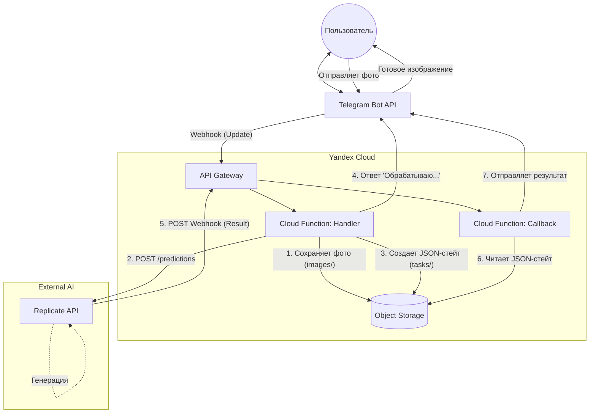

```mermaid
graph TD
    User((Пользователь)) <--> TG[Telegram Bot API]
    
    subgraph "Yandex Cloud"
        AGW[API Gateway]
        HandleFn[Cloud Function: Handler]
        ObjectStorage[(Object Storage)]
        ResultFn[Cloud Function: Callback]
    end
    
    subgraph "External AI"
        Replicate[Replicate API]
    end

    %% Процесс отправки
    User -- "Отправляет фото" --> TG
    TG -- "Webhook (Update)" --> AGW
    AGW --> HandleFn
    
    HandleFn -- "1. Сохраняет фото (images/)" --> ObjectStorage
    HandleFn -- "2. POST /predictions" --> Replicate
    HandleFn -- "3. Создает JSON-стейт (tasks/)" --> ObjectStorage
    HandleFn -- "4. Ответ 'Обрабатываю...'" --> TG
    
    %% Процесс обработки
    Replicate -. "Генерация" .-> Replicate
    
    %% Процесс результата
    Replicate -- "5. POST Webhook (Result)" --> AGW
    AGW --> ResultFn
    ResultFn -- "6. Читает JSON-стейт" --> ObjectStorage
    ResultFn -- "7. Отправляет результат" --> TG
    TG -- "Готовое изображение" --> User
```