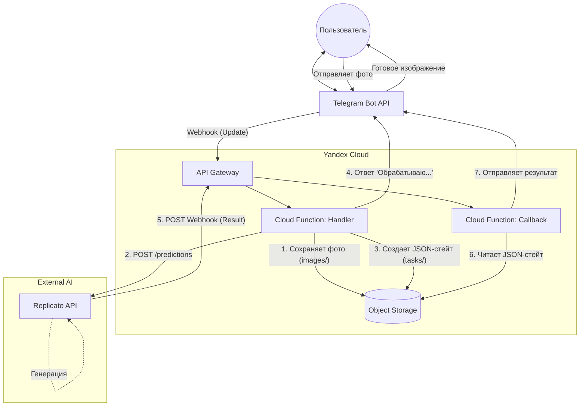

# 2. Архитектура

## Поток данных (Yandex Cloud)

## Локальный эквивалент

| Yandex Cloud            | Локально                         |
|-------------------------|----------------------------------|
| Cloud Function: Handler | FastAPI, роут `/webhook/telegram` |
| Cloud Function: Callback| FastAPI, роут `/webhook/replicate` |
| Object Storage          | Yandex Object Storage (рекомендуется) или MinIO (S3-совместимый) |
| API Gateway             | FastAPI (прямые HTTP-роуты)      |

**Примечание:** Начиная с feature-2.5 рекомендуется использовать Yandex Object Storage для локальной разработки вместо MinIO. Это обеспечивает публичный доступ к presigned URL и близость к production-окружению.
